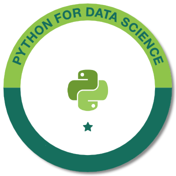

# Python for Data Science  
  
  
  
> My Python studies for Data Science.  
__NOTE:__ The implementations and tips will be in Brazilian Portuguese (PT-BR).  
  
  
  
# Contents  
  
 - __Python Data Analysis Modules:__
   - [NumPy](01-python-data-analysis-modules/01-NumPy/01-NumPy.ipynb)  
   - [Pandas](01-python-data-analysis-modules/02-Pandas/02-Pandas.ipynb)  
   - [Matplotlib](01-python-data-analysis-modules/03-Matplotlib/03-Matplotlib.ipynb)  
   - [SciPy](01-python-data-analysis-modules/04-SciPy/04-SciPy.ipynb)  
   - [Scikit-Learn](01-python-data-analysis-modules/05-Scikit-Learn/5-Scikit-Learn.ipynb)  
   - [Seaborn](01-python-data-analysis-modules/06-Seaborn/06-Seaborn.ipynb)  
 - __TensorFlow:__  
   - [Introduction to TensorFlow](02-introduction-to-tensorflow/Intro-to-TensorFlow.ipynb)  
 - __Machine Learning:__  
   - [Introduction to Machine Learning with Python](03-introduction-to-machine-learning-with-python/Introduction-to-Machine-Learning.ipynb)  
 - __Linear Algebra:__  
   - [x](#)  
  
__References:__  
[Python Fundamentos para Análise de Dados - Data Science Academy](https://www.datascienceacademy.com.br/course?courseid=python-fundamentos)  
[Python para Data Science e Machine Learning - Udemy](https://www.udemy.com/python-para-data-science-e-machine-learning)  
  
<strong>Rodrigo Leite - Software Engineer</strong>